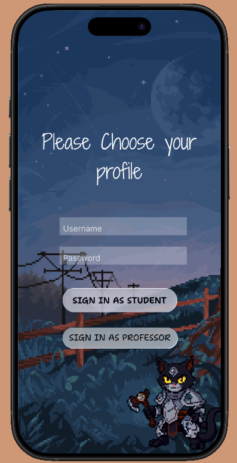
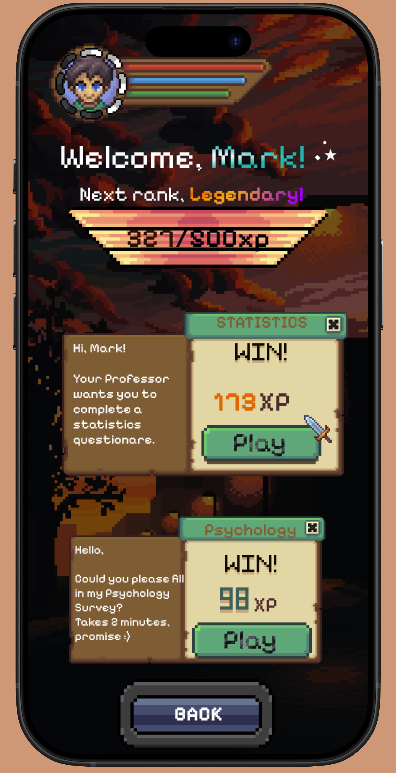
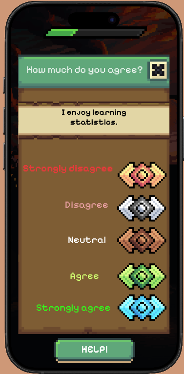
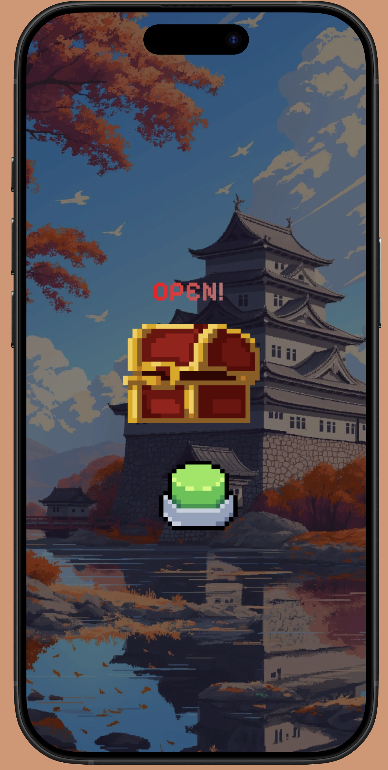
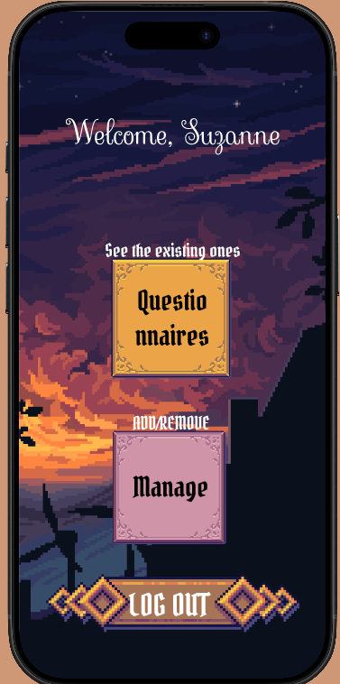
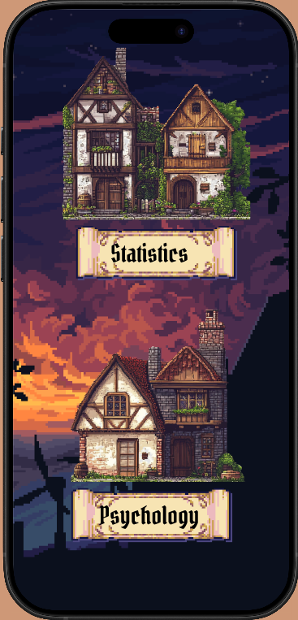

## Prototype

Figma prototype:
[Open the Figma prototype](https://www.figma.com/design/wE49npk6KwoE6tXtMVA1D0/Questionnaire?node-id=0-1&t=wRjWZwXsmBGCXbvl-1)

# Pixel Quest Questionnaire App

A mobile UX prototype made in Figma to showcase UX principles for creating a more engaging questionnaire experience.
The project uses pixel-art visuals, RPG-style progression, quests, XP rewards, and role-based screens to make academic questionnaires feel more interactive and motivating.

## Screenshots

  
  
  

  
  <b>Login / Profile Selection</b> &nbsp;&nbsp;&nbsp;
  <b>Student Dashboard</b> &nbsp;&nbsp;&nbsp;
  <b>Reward</b>

 

  
  
  

  <b>Quest Selection</b> &nbsp;&nbsp;&nbsp;
  <b>Questionnaire Screen</b> &nbsp;&nbsp;&nbsp;
  <b>Professor Dashboard</b>

## UX Focus

This project explores how gamification can improve a simple questionnaire flow. Instead of showing users a plain form, the app presents tasks as RPG-style quests with progress, rewards, and a clear sense of achievement.

Main UX principles used:

* **Gamification:** XP, ranks, quests, and rewards make tasks feel more motivating.
* **Clear visual hierarchy:** large buttons, task cards, and readable sections guide the user.
* **Role-based navigation:** students and professors have separate entry points.
* **Mobile-first design:** the layout is made for quick interaction on a phone screen.
* **Consistent visual identity:** pixel-art assets create a playful and memorable interface.

## User Flow

1. The user signs in as a student or professor.
2. Students see assigned questionnaire quests.
3. Each quest shows the subject, reward, and action button.
4. Users answer questions and gain progress through XP.
5. Professors can access a separate screen for managing questionnaires.

## Tools Used

* Figma
* Mobile UI design
* UX prototyping
* Pixel-art visual assets
* Gamification principles

## Credits

Some visual assets were created by artists on itch.io. This project is used for learning and portfolio purposes.

## Project Status

This is an early UX prototype focused on interaction flow, visual design, and user engagement. Future improvements could include user testing, better accessibility, and a coded version of the app.
